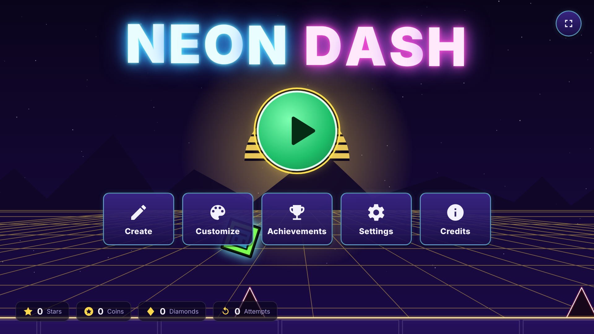

# Neon Dash

An original one-button rhythm platformer in plain HTML, CSS and JavaScript (ES modules,
Canvas 2D, Web Audio). Nine handcrafted levels with synthesized music, eight game modes, practice
mode, a full level editor, cosmetics and achievements. No build step, no dependencies, no network
requests at runtime.



## Run it

```sh
python3 -m http.server 8000
# open http://localhost:8000
```

Any static file server works (ES modules need `http://`, not `file://`).

## Controls

| Action | Keyboard / mouse | Gamepad | Touch |
|---|---|---|---|
| Jump / fly / flip | Space, ↑, W, left click | A, RT, any face button | tap anywhere |
| Pause / back | Esc | Start (back: B) | ⏸ button |
| Restart | R | | |
| Practice mode on/off | P | | pause menu |
| Place / remove checkpoint | Z / X | | on-screen buttons in practice |
| Hitboxes · FPS · mute · fullscreen | H · F · M · F11 | | |
| Menus | arrows / Tab, Enter | D-pad / stick, A | tap |

Keys are rebindable in **Settings → Controls**. Hold-to-jump works for the cube (and robot, ship,
wave, swing as their mode requires); presses up to 80 ms before landing are buffered and a 40 ms
coyote window forgives late jumps off ledges.

Editor shortcuts are listed in the editor's **ⓘ** dialog (B/V/E tools, 1–0 quick picks, R rotate,
X/Y flip, WASD nudge, Ctrl+C/V/D/Z/Y/S, arrows or right-drag to pan, wheel to zoom,
Enter / Shift+Enter to playtest from the start / the cursor).

## Features

- **Engine**: deterministic 240 Hz fixed-step physics with timestamped input (identical results at
  30/60/144/240 FPS), render interpolation, 1920×1080 logical view letterboxed to any screen,
  HiDPI, axis-separated collision with SAT spikes, circular saws and 45° / 2:1 slopes,
  uniform-grid spatial partition.
- **Modes**: cube, ship, ball, UFO, wave, robot, spider, swing; mini size, five speeds, gravity,
  mirror and dual portals.
- **Objects**: blocks (full, half, slab, panel, brick), slopes, spikes (large/small, any rotation),
  three saw sizes with movement paths, yellow/pink/red/blue pads, yellow/pink/red/blue/green/black
  and dash orbs, secret coins, end wall, decoration, and colour / move / rotate / scale / alpha /
  toggle / pulse / zoom / shake / particle triggers.
- **Levels**: First Steps (Easy, 128 BPM), Neon Skyline (Easy, 140), Gravity Well (Normal, 120),
  Pulse Reactor (Normal, 132), Wave Runner (Hard, 156), Mirror Maze (Hard, 126), Saw Factory
  (Harder, 136), Final Descent (Insane, 160) and the hidden Prism Core (Demon, 145), unlocked by
  collecting all 24 secret coins. Obstacles sit on the music's beat grid; every level ships with a
  solver-generated bot recording that the tests replay.
- **Practice mode**: manual and timed auto checkpoints that restore the full state (triggers,
  moving objects, music position), quieter practice mix, best practice %.
- **Audio**: Web Audio synth (drums, bass, leads, arps, pads, FX) with a look-ahead step sequencer
  on the AudioContext clock; one track per level plus menu, editor and level-complete music;
  master/music/SFX volumes; beat-synced visuals.
- **Editor**: grid placement, box/multi select, move/rotate/flip, copy/paste/duplicate, 200-step
  undo, snap, layers, categorized palette, properties incl. trigger parameters, level settings,
  playtest from start or cursor, save slots, JSON export/import (file picker or drag-and-drop),
  autosave with crash recovery, validation warnings, "My Levels" tab.
- **Progress**: stars unlock levels, orbs/diamonds/coins/achievements unlock 62 icons, 24 colours
  and 6 trails; 29 achievements; lifetime statistics; versioned save with migration and
  export/import.
- **Accessibility**: full keyboard and gamepad navigation with visible focus, ARIA labels,
  colour-blind palette (hazards and orbs also carry shape glyphs), reduce flashing, reduced motion
  (follows the system setting), large UI option, adjustable screen shake.

## Tests

```sh
node tests/run.mjs            # 39 sim/level/editor/save tests in Node (~3 s)
node tests/browser.mjs        # Playwright + Chromium: console errors, screenshots, viewports,
                              # frame time, 5-minute heap check (~9 min; --skip-heap for ~2 min)
```

The same suite also runs in the page at `http://localhost:8000/?test=1` (plus an offline audio
render check). `tests/browser.mjs` uses a global Playwright install; set `PLAYWRIGHT_MODULE` or
`CHROMIUM_PATH` to point it elsewhere. Screenshots land in `docs/screenshots/`.

Debug URLs: `?bot=1&level=N&t=SECONDS` watches the bot play level N from a time,
`?screen=editor|customize|settings|…` opens a screen directly.

## Add a level

1. Create `js/levels/level10.js` with the builder, which places things **by beat**:

   ```js
   import { LevelBuilder } from './builder.js';
   import { stepUp, padTo, colors } from './patterns.js';

   const b = new LevelBuilder({
     id: 'my-level', name: 'My Level', difficulty: 'normal', stars: 3,
     bpm: 128, song: 'firstSteps', startMode: 'cube', startSpeed: 1,
     palette: { bg: '#10062b', ground: '#1f0b4a', line: '#7df9ff', obj: '#7df9ff', deco: '#ff5ce1' },
   });
   b.spikesAt(8);              // a spike cleared by a jump pressed on beat 8
   b.spikesAt(10, 2);          // a double on beat 10
   stepUp(b, 12, 1, 6);        // a 1-high, 6-long platform reached from beat 12
   b.gate('portalShip', b.x(16) + 1, 1.5);   // a portal you cannot fly around
   colors(b, 16, { bg: '#20004a' });
   b.end(b.x(32));
   export default b.build();
   ```

2. Register it in `js/levels/index.js` (array order is unlock order).
3. Validate it and write the bot recording the tests replay:
   `node tools/solve.mjs level10 --fair` (add `--coins` for an all-coins run).
   `node tools/inspect.mjs level10 <x>` lists the objects around a position.

Levels can also be built in the editor and exported; the JSON has the same
`{ meta, objects, triggers }` shape (see DESIGN.md).

## Add a music track

Tracks are pattern data in `js/tracks.js`: tempo, key (`root` MIDI note), scale, chord progression,
instrument settings, named drum/bass/lead/arp patterns (one character per 16th note) and a `song`
list of sections. Add an entry to `TRACKS`, add its id to `LEVEL_SONGS` so the editor offers it,
and set `meta.song` in a level. The test suite checks every pattern is well-formed and the in-page
suite renders each track offline to check it is audible and does not clip.

## Project structure

```
index.html, css/            page shell, UI and editor styles
js/main.js                  bootstrap, rAF loop, state machine, transitions
js/config.js objects.js     constants, object type table
js/sim.js camera.js         deterministic simulation and camera
js/player.js physics.js collision.js level.js triggers.js
js/game.js gameview.js      play session (practice, death, pause, effects) and its drawing
js/renderer.js background.js objsprites.js deco.js icons.js particles.js color.js
js/audio.js synth.js tracks.js
js/input.js ui.js screens/  input (keyboard, pointer, gamepad, rebinding), DOM UI and screens
js/editor*.js               level editor
js/storage.js progress.js achievements.js cosmetics.js
js/levels/                  builder, pattern library, levels 1–9
js/lint.js                  level lint (floating spikes)
tests/                      Node + browser tests, bot replay, recordings
tools/                      solver / fairness analysis, level inspector
docs/screenshots/           captured by tests/browser.mjs
```

## Known limitations

- Headless Chromium's software rasteriser runs the busiest levels at ~30–40 FPS at 1920×1080
  (60 FPS at 1280×720); the game's own update + render work is under 1 ms per frame, so
  GPU-accelerated browsers are not affected. Lower glow quality helps on weak machines.
- Fairness analysis measures the solver's own path, so a few reported minimum windows (Final
  Descent's 42 ms) reflect the bot's choices rather than the easiest human line.
- Solid blocks are always axis-aligned: a block (or a block in a group turned by a rotate trigger)
  uses its rotation snapped to 90° for its footprint. Spikes, slopes, saws and decoration rotate freely.
- The editor has no touch-specific gestures (pinch zoom); it is designed for mouse and keyboard.
- Only English is available; the language setting exists for future translations.
- Audio needs one user gesture before it can start (browser autoplay rules); the game unlocks it on
  the first key press, click or tap.
